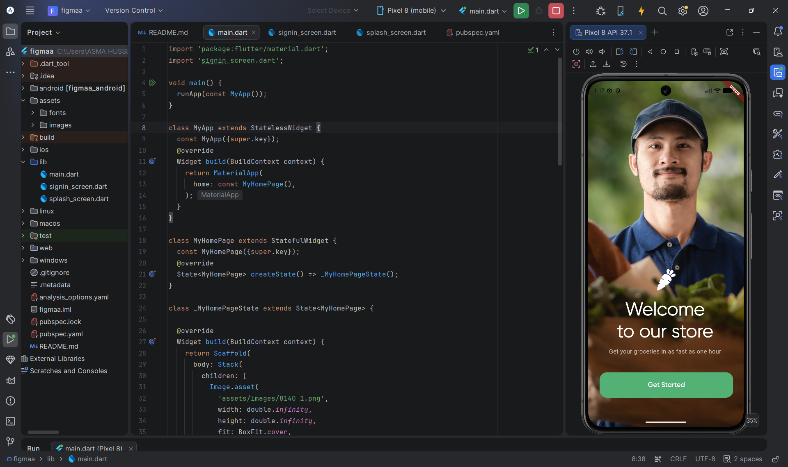
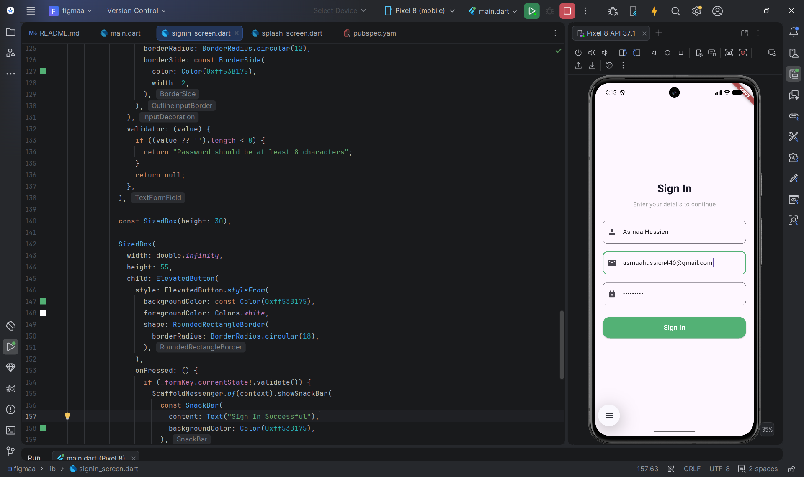

# Flutter Grocery UI

A Flutter UI project based on a Figma design for a grocery shopping application.

## Screens

### 1. Welcome Screen
A modern onboarding screen with:
- Full-screen background image
- App logo
- Welcome message
- Get Started button

### 2. Sign In Screen
A clean sign in form including:
- Name field
- Email field
- Password field
- Input validation
- Success SnackBar
- Responsive layout

## Built With

- Flutter
- Dart
- Material Design

## Features

- Pixel-inspired UI based on Figma
- Form validation
- Clean and readable code
- Responsive layout
- Easy navigation between screens

## Screenshots

### Welcome Screen

### Sign In Screen

## Author

**Asmaa Hussien**

GitHub:
https://github.com/asmaahusien440-droid
