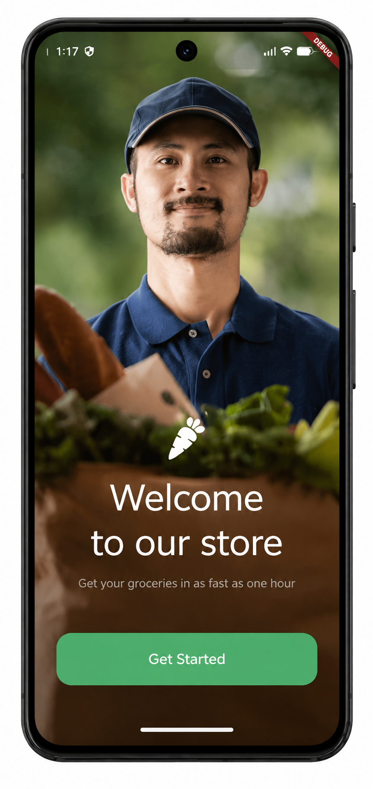
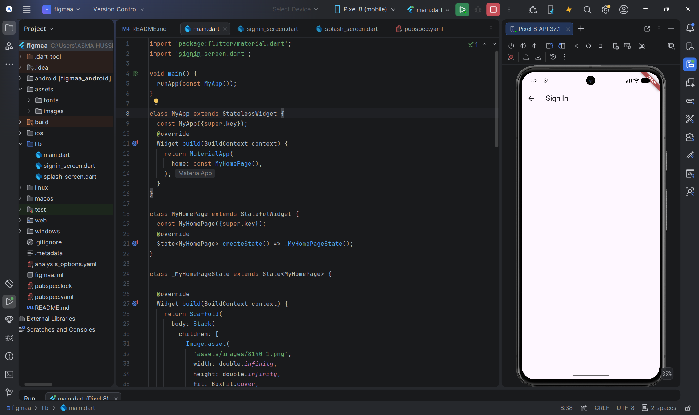

# Flutter Grocery UI

A Flutter UI project based on a Figma design for a grocery shopping application.

---

# Screens

## 1. Welcome Screen

Features:
- Full-screen background image
- Grocery logo
- Welcome message
- Get Started button
- Responsive layout

### Preview



---

## 2. Sign In Screen

Features:
- Name field
- Email field
- Password field
- Form validation
- Rounded text fields
- Green Sign In button
- Success SnackBar
- Responsive layout

### Preview



---

# Built With

- Flutter
- Dart
- Material Design
- Figma

---

# Project Structure

```text
lib/
├── main.dart
├── splash_screen.dart
└── signin_screen.dart

assets/
├── images/
└── fonts/
```

---

# Author

**Asmaa Hussien**

GitHub:
https://github.com/asmaahusien440-droid
